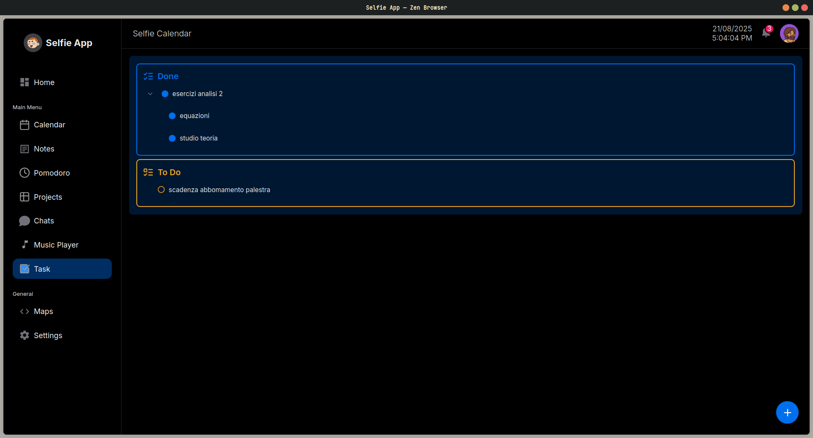

# Selfie

## Project Overview
Manage Your University Life with Ease: Introducing Selfie
With Selfie, university students can effortlessly plan their private, social, and academic lives with maximum flexibility and completeness. Selfie is a client-server application that can be used seamlessly from both mobile and PC. It is organized into modules designed to support the various types of events, deadlines, and commitments that make up student life.

## Features
**The life of a university student is diverse and complex, filled with events, deadlines, and commitments that range widely:**
- Individual or group-based
- One-time (like a casual hangout this Friday at 7 PM) or recurring (weekly soccer game every Tuesday at 8 PM)
- Simple (exam on June 12th at 11 AM) or more structured (study theory from May 10-21, prepare the project from May 22 to June 5, group demo on June 6, debugging from June 7-11, written exam preparation, followed by the written exam on June 12). Often, these events overlap.

## Photos

Click to see more photos

## Dev

Follow the instructions in the `client/` and `server/` directories to run the project locally.

## Authors
- Omar Ayache
- Emanuele Argonni
- Diego Barbieri
